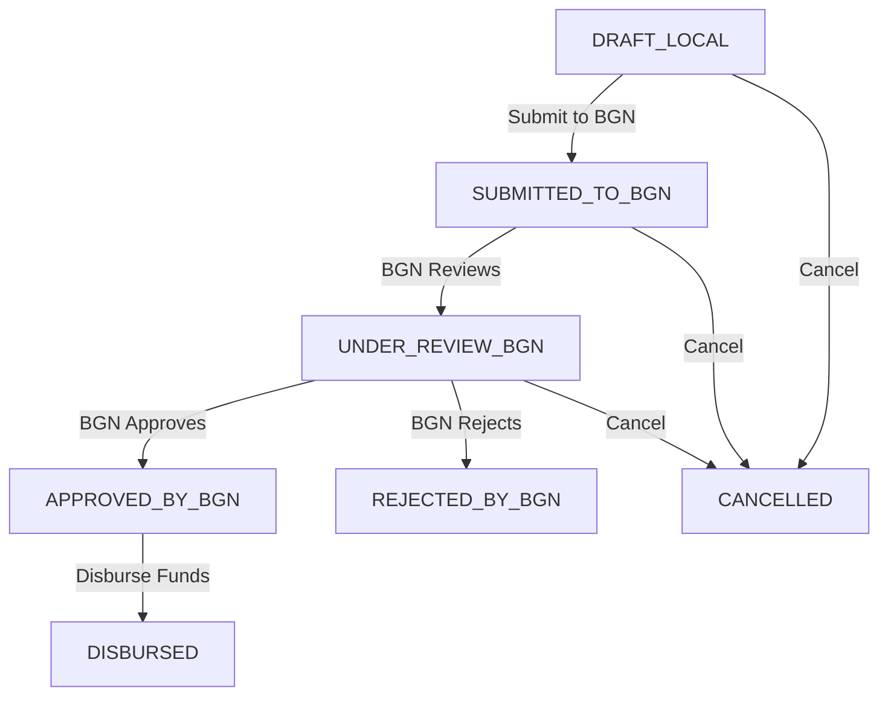

# Government Budget Tracking (Banper) - Implementation Documentation

## 📋 Overview

**Feature**: Government Budget Tracking and Management  
**Implementation Date**: November 12, 2025  
**Version**: 1.0.0  
**Platform**: Bagizi-ID SaaS Platform (Next.js 15.5.4)

### Purpose

Sistem pelacakan dan manajemen anggaran pemerintah (Banper - Bantuan Pemerintah) untuk SPPG yang mencakup:
- Permintaan bantuan anggaran dari pemerintah (BGN Portal)
- Pelacakan status persetujuan multi-tahap
- Manajemen alokasi anggaran per program
- Pencatatan transaksi penggunaan anggaran
- Dashboard statistik anggaran real-time

---

## 🏗️ Architecture Overview

### Database Models (Prisma Schema)

```prisma
// Pelacakan permintaan banper ke BGN
model BanperRequestTracking {
  id                      String              @id @default(cuid())
  programId               String?
  program                 NutritionProgram?   @relation(...)
  sppgId                  String
  sppg                    SPPG                @relation(...)
  
  // Request Info
  bgnRequestNumber        String              @unique
  requestedAmount         Float
  operationalPeriod       String
  totalBeneficiaries      Int
  
  // BGN Status Tracking
  bgnStatus               BgnRequestStatus    @default(DRAFT_LOCAL)
  bgnSubmissionDate       DateTime?
  bgnApprovalNumber       String?
  bgnApprovalDate         DateTime?
  disbursedAmount         Float?
  
  // Relations
  budgetAllocations       ProgramBudgetAllocation[]
  
  @@index([sppgId, bgnStatus])
}

// Alokasi anggaran per program dari berbagai sumber
model ProgramBudgetAllocation {
  id                  String                    @id @default(cuid())
  programId           String
  program             NutritionProgram          @relation(...)
  sppgId              String
  sppg                SPPG                      @relation(...)
  
  // Allocation Details
  source              BudgetSource              // APBN_PUSAT, APBD_PROVINSI, etc.
  allocatedAmount     Float
  spentAmount         Float                     @default(0)
  fiscalYear          Int
  status              BudgetAllocationStatus    @default(ACTIVE)
  
  // Relations
  banperTrackingId    String?
  banperTracking      BanperRequestTracking?    @relation(...)
  transactions        BudgetTransaction[]
  
  @@index([sppgId, status])
}

// Transaksi penggunaan anggaran
model BudgetTransaction {
  id                  String                      @id @default(cuid())
  allocationId        String
  allocation          ProgramBudgetAllocation     @relation(...)
  
  // Transaction Details
  transactionNumber   String                      @unique
  transactionDate     DateTime
  category            BudgetTransactionCategory   // FOOD_PROCUREMENT, OPERATIONAL, etc.
  amount              Float
  description         String
  
  // Approval
  approvedBy          String?
  approvedAt          DateTime?
  
  @@index([allocationId, transactionDate])
}
```

### Enums

```typescript
enum BgnRequestStatus {
  DRAFT_LOCAL          // Draft lokal, belum diajukan
  SUBMITTED_TO_BGN     // Sudah diajukan ke BGN Portal
  UNDER_REVIEW_BGN     // Sedang direview BGN
  APPROVED_BY_BGN      // Disetujui BGN
  DISBURSED            // Dana sudah dicairkan
  REJECTED_BY_BGN      // Ditolak BGN
  CANCELLED            // Dibatalkan
}

enum BudgetSource {
  APBN_PUSAT          // Anggaran Pendapatan dan Belanja Negara - Pusat
  APBD_PROVINSI       // APBD Tingkat Provinsi
  APBD_KABUPATEN      // APBD Tingkat Kabupaten/Kota
  DAK                 // Dana Alokasi Khusus
  BANPER_KEMENSOS     // Bantuan Pemerintah Kemensos
  CSR                 // Corporate Social Responsibility
  HIBAH               // Hibah/Grant
  SWADAYA             // Swadaya Masyarakat
  LAINNYA             // Sumber Lainnya
}

enum BudgetAllocationStatus {
  ACTIVE              // Aktif, dapat digunakan
  EXHAUSTED           // Habis terpakai
  SUSPENDED           // Ditangguhkan
  EXPIRED             // Kadaluarsa
  REALLOCATED         // Dialokasikan ulang
  CANCELLED           // Dibatalkan
}

enum BudgetTransactionCategory {
  FOOD_PROCUREMENT    // Pengadaan Bahan Pangan
  OPERATIONAL         // Biaya Operasional
  TRANSPORT           // Biaya Transportasi
  UTILITIES           // Utilitas (Listrik, Air, Gas)
  STAFF_SALARY        // Gaji Pegawai
  EQUIPMENT           // Peralatan
  MAINTENANCE         // Pemeliharaan
  TRAINING            // Pelatihan
  MARKETING           // Pemasaran/Sosialisasi
  PACKAGING           // Pengemasan
  OTHER               // Lainnya
}
```

---

## 🗂️ File Structure

```
src/
├── features/sppg/banper-tracking/
│   ├── api/
│   │   ├── banperTrackingApi.ts       # API client untuk banper requests
│   │   ├── budgetAllocationsApi.ts    # API client untuk allocations
│   │   ├── budgetTransactionsApi.ts   # API client untuk transactions
│   │   └── index.ts
│   ├── components/
│   │   ├── BanperTrackingList.tsx     # Data table banper requests
│   │   ├── BudgetAllocationList.tsx   # Data table allocations
│   │   ├── BudgetTransactionList.tsx  # Data table transactions
│   │   ├── BudgetStats.tsx            # Dashboard statistics
│   │   └── index.ts
│   ├── hooks/
│   │   ├── useBanperTracking.ts       # 8 hooks untuk banper CRUD
│   │   ├── useBudgetAllocations.ts    # 5 hooks untuk allocations
│   │   ├── useBudgetTransactions.ts   # 6 hooks untuk transactions
│   │   └── index.ts
│   ├── lib/
│   │   └── schemas.ts                 # Zod validation schemas
│   └── types/
│       └── index.ts                   # TypeScript type definitions
│
├── app/(sppg)/
│   ├── banper-tracking/
│   │   ├── page.tsx                   # List page with dashboard
│   │   └── [id]/
│   │       └── page.tsx               # Detail page with workflow
│   └── budget-transactions/
│       └── page.tsx                   # Transactions list page
│
├── app/api/sppg/
│   ├── banper-tracking/
│   │   ├── route.ts                   # GET, POST /api/sppg/banper-tracking
│   │   └── [id]/
│   │       ├── route.ts               # GET, PUT, DELETE
│   │       ├── submit/route.ts        # POST submit to BGN
│   │       ├── approve/route.ts       # POST record approval
│   │       └── disburse/route.ts      # POST record disbursement
│   ├── budget-allocations/
│   │   ├── route.ts                   # GET, POST
│   │   └── [id]/
│   │       └── route.ts               # GET, PUT, DELETE
│   └── budget-transactions/
│       ├── route.ts                   # GET, POST
│       └── [id]/
│           ├── route.ts               # GET, PUT, DELETE
│           └── approve/route.ts       # POST approve transaction
│
└── components/shared/navigation/
    └── SppgSidebar.tsx                # Navigation menu (updated)
```

**Total Files Created/Modified**: 28 files
- API Routes: 10 files
- Hooks: 4 files (19 hooks total)
- Components: 5 files
- Pages: 3 files
- Types: 1 file
- Schemas: 1 file
- Navigation: 1 file (modified)

---

## 🔄 Workflow & Business Logic

### 1. Banper Request Workflow



**Status Flow:**

1. **DRAFT_LOCAL** → Permintaan dibuat, belum diajukan
   - User dapat edit/delete
   - Belum ada nomor BGN

2. **SUBMITTED_TO_BGN** → Diajukan ke BGN Portal
   - Requires: `bgnRequestNumber`, `bgnSubmissionDate`
   - User tidak bisa edit lagi
   - Menunggu review BGN

3. **UNDER_REVIEW_BGN** → Sedang direview BGN
   - Status sementara (optional)
   - Bisa langsung dari SUBMITTED ke APPROVED

4. **APPROVED_BY_BGN** → Disetujui BGN
   - Requires: `bgnApprovalNumber`, `bgnApprovalDate`, `bgnApprovedByName`, `bgnApprovedByPosition`
   - Siap untuk pencairan

5. **DISBURSED** → Dana dicairkan
   - Requires: `disbursedAmount`, `disbursedDate`, `bankReferenceNumber`, `bankAccountReceived`
   - Otomatis create `ProgramBudgetAllocation`
   - Status final (sukses)

6. **REJECTED_BY_BGN** → Ditolak BGN
   - Status final (gagal)

7. **CANCELLED** → Dibatalkan
   - Bisa dari DRAFT, SUBMITTED, atau UNDER_REVIEW
   - Status final (batal)

### 2. Budget Allocation Management

**Auto-creation on Disbursement:**
```typescript
// When banper request status → DISBURSED
const allocation = await db.programBudgetAllocation.create({
  data: {
    programId: request.programId,
    sppgId: request.sppgId,
    source: 'BANPER_KEMENSOS',
    banperTrackingId: request.id,
    allocatedAmount: request.disbursedAmount,
    spentAmount: 0,
    fiscalYear: new Date().getFullYear(),
    status: 'ACTIVE',
    allocatedDate: new Date(),
  }
})
```

**Budget Status Management:**
- `ACTIVE` → Available for spending
- `EXHAUSTED` → `spentAmount >= allocatedAmount`
- `SUSPENDED` → Temporarily frozen
- `EXPIRED` → Past fiscal year
- `REALLOCATED` → Moved to different allocation
- `CANCELLED` → Allocation cancelled

### 3. Budget Transaction Recording

**Auto-update Allocation on Transaction:**
```typescript
// On transaction create/update/delete
await db.programBudgetAllocation.update({
  where: { id: allocationId },
  data: {
    spentAmount: {
      increment: amount  // or decrement on delete
    }
  }
})

// Auto-update status if exhausted
if (newSpentAmount >= allocation.allocatedAmount) {
  await db.programBudgetAllocation.update({
    where: { id: allocationId },
    data: { status: 'EXHAUSTED' }
  })
}
```

---

## 🎯 API Endpoints

### Banper Tracking

#### `GET /api/sppg/banper-tracking`
List all banper requests for current SPPG

**Response:**
```json
{
  "success": true,
  "data": [
    {
      "id": "cm3abc123",
      "bgnRequestNumber": "BGN-2025-001",
      "requestedAmount": 500000000,
      "bgnStatus": "APPROVED_BY_BGN",
      "program": { "id": "...", "name": "Program Makan Bergizi", ... },
      "sppg": { "id": "...", "name": "SPPG Jakarta Pusat", ... }
    }
  ]
}
```

#### `POST /api/sppg/banper-tracking`
Create new banper request

**Request:**
```json
{
  "programId": "cm3prog123",
  "requestedAmount": 500000000,
  "operationalPeriod": "6 months",
  "totalBeneficiaries": 500,
  "foodCostTotal": 300000000,
  "operationalCost": 200000000
}
```

#### `POST /api/sppg/banper-tracking/[id]/submit`
Submit request to BGN

**Request:**
```json
{
  "bgnRequestNumber": "BGN-2025-001",
  "bgnSubmissionDate": "2025-11-12T10:00:00Z",
  "bgnPortalUrl": "https://bgn.go.id/request/..."
}
```

#### `POST /api/sppg/banper-tracking/[id]/approve`
Record BGN approval

**Request:**
```json
{
  "bgnApprovalNumber": "SK-001/BGN/2025",
  "bgnApprovalDate": "2025-11-15T14:00:00Z",
  "bgnApprovedByName": "Dr. Ahmad Budiman",
  "bgnApprovedByPosition": "Kepala BGN"
}
```

#### `POST /api/sppg/banper-tracking/[id]/disburse`
Record fund disbursement (auto-creates allocation)

**Request:**
```json
{
  "disbursedAmount": 500000000,
  "disbursedDate": "2025-11-20T09:00:00Z",
  "bankReferenceNumber": "TRF-202511-12345",
  "bankAccountReceived": "1234567890"
}
```

### Budget Allocations

#### `GET /api/sppg/budget-allocations`
List all budget allocations

#### `POST /api/sppg/budget-allocations`
Create manual allocation

**Request:**
```json
{
  "programId": "cm3prog123",
  "source": "APBD_PROVINSI",
  "allocatedAmount": 100000000,
  "allocatedDate": "2025-11-01T00:00:00Z",
  "fiscalYear": 2025,
  "decreeNumber": "SK-100/2025"
}
```

### Budget Transactions

#### `GET /api/sppg/budget-transactions`
List all transactions

#### `POST /api/sppg/budget-transactions`
Record new transaction (auto-updates allocation)

**Request:**
```json
{
  "allocationId": "cm3alloc123",
  "transactionDate": "2025-11-12T00:00:00Z",
  "category": "FOOD_PROCUREMENT",
  "amount": 5000000,
  "description": "Pembelian beras 500kg",
  "receiptNumber": "INV-2025-001"
}
```

#### `POST /api/sppg/budget-transactions/[id]/approve`
Approve transaction

**Request:**
```json
{
  "approvedBy": "John Doe",
  "approvalNotes": "Approved after verification"
}
```

---

## 🎨 UI Components

### 1. BudgetStats (Dashboard Statistics)

**Features:**
- 8+ real-time stat cards
- Total allocated, spent, remaining budget
- Pending disbursement tracking
- Request status breakdown
- Budget by source visualization
- Progress bars and trends
- Loading skeleton states

**Usage:**
```tsx
import { BudgetStats } from '@/features/sppg/banper-tracking/components'

<BudgetStats />
```

### 2. BanperTrackingList (Request Data Table)

**Features:**
- 7 columns: Request number, program, amount, status, dates, actions
- Status badges with 7 states (color-coded)
- Conditional actions: View, Edit, Submit, Disburse, Delete
- Currency formatting (IDR)
- Indonesian date formatting
- Dark mode support

**Columns:**
- BGN Request Number
- Program Name
- Requested Amount
- BGN Status
- Submission Date
- Disbursed Amount
- Actions (dropdown)

### 3. BudgetAllocationList (Allocation Data Table)

**Features:**
- 8 columns with progress tracking
- Progress bar showing budget usage
- Budget source labels
- Status badges (6 allocation states)
- Delete validation (only if spentAmount === 0)
- View transactions filtered by allocation

**Columns:**
- Program
- Budget Source
- Fiscal Year
- Allocated Amount
- Usage Progress (spent/remaining)
- Status
- Allocated Date
- Actions

### 4. BudgetTransactionList (Transaction Data Table)

**Features:**
- Transaction category badges with icons (10 categories)
- Approval status tracking
- Conditional actions based on approval status
- Delete/edit only for unapproved transactions
- Approve action with approver info
- Filter by allocation support

**Columns:**
- Transaction Number
- Transaction Date
- Category (with icon)
- Allocation/Program
- Description
- Amount
- Approval Status
- Actions

---

## 🔐 Security & Permissions

### RBAC (Role-Based Access Control)

**Allowed Roles:**
```typescript
const allowedRoles: UserRole[] = [
  'PLATFORM_SUPERADMIN',  // Full access
  'SPPG_KEPALA',         // SPPG Head - all operations
  'SPPG_ADMIN',          // SPPG Admin - all operations
  'SPPG_AKUNTAN',        // Accountant - view + financial ops
  'SPPG_STAFF',          // Staff - view only
]
```

### Multi-tenant Security

**Every query filters by sppgId:**
```typescript
// Example: Get banper requests
const requests = await db.banperRequestTracking.findMany({
  where: {
    program: {
      sppgId: session.user.sppgId  // MANDATORY!
    }
  }
})
```

**Ownership Verification:**
```typescript
// Before any mutation
const existing = await db.banperRequestTracking.findFirst({
  where: {
    id: params.id,
    program: {
      sppgId: session.user.sppgId
    }
  }
})

if (!existing) {
  return NextResponse.json({ error: 'Not found' }, { status: 404 })
}
```

---

## 📊 Testing Checklist

### ✅ Unit Tests

- [ ] Zod schema validation
- [ ] API client functions
- [ ] Hook state management
- [ ] Utility functions (formatters, calculators)

### ✅ Integration Tests

- [ ] API endpoint responses
- [ ] Database operations
- [ ] Multi-tenant data isolation
- [ ] Permission checks

### ✅ E2E Workflow Tests

#### Banper Request Workflow
- [ ] Create new banper request (DRAFT_LOCAL)
- [ ] Edit draft request
- [ ] Submit request to BGN (SUBMITTED_TO_BGN)
- [ ] Record BGN approval (APPROVED_BY_BGN)
- [ ] Disburse funds (DISBURSED)
- [ ] Verify allocation auto-created
- [ ] Cancel request at different stages
- [ ] Delete draft request

#### Budget Allocation Tests
- [ ] Create manual allocation
- [ ] Edit allocation details
- [ ] View allocation usage
- [ ] Filter transactions by allocation
- [ ] Verify status changes to EXHAUSTED
- [ ] Delete unused allocation

#### Budget Transaction Tests
- [ ] Record new transaction
- [ ] Verify allocation spentAmount updated
- [ ] Approve transaction
- [ ] Edit unapproved transaction
- [ ] Delete unapproved transaction
- [ ] Verify approved transactions cannot be deleted
- [ ] Test category filtering

#### UI/UX Tests
- [ ] Navigation menu appears correctly
- [ ] All pages load without errors
- [ ] Stats dashboard shows correct calculations
- [ ] Data tables display and sort correctly
- [ ] Actions dropdown shows correct options
- [ ] Dark mode works on all components
- [ ] Indonesian formatting (currency, dates)
- [ ] Loading states display properly
- [ ] Error messages are user-friendly

### ✅ Performance Tests

- [ ] Page load time < 3 seconds
- [ ] API response time < 200ms
- [ ] Large dataset rendering (1000+ records)
- [ ] Query optimization (proper indexes used)
- [ ] Cache invalidation works correctly

---

## 🚀 Deployment Checklist

### Pre-deployment
- [ ] All TypeScript compilation errors fixed
- [ ] All ESLint warnings resolved
- [ ] Database migrations tested
- [ ] Seed data prepared (optional)
- [ ] Environment variables configured

### Database
- [ ] Run migrations: `npx prisma migrate deploy`
- [ ] Verify indexes created
- [ ] Check foreign key constraints
- [ ] Test rollback procedures

### Application
- [ ] Build successful: `npm run build`
- [ ] No runtime errors in production build
- [ ] API endpoints tested in staging
- [ ] Navigation works end-to-end
- [ ] Authentication/authorization verified

### Monitoring
- [ ] Error tracking configured (Sentry)
- [ ] Performance monitoring enabled
- [ ] Database query performance monitored
- [ ] User analytics tracking

---

## 📚 User Guide

### For SPPG Users

#### 1. Mengajukan Permintaan Banper

1. Buka menu **"Anggaran Pemerintah" → "Permintaan Banper"**
2. Klik tombol **"Buat Permintaan Banper"**
3. Isi form permintaan:
   - Pilih program yang akan didanai
   - Masukkan jumlah anggaran yang diminta
   - Isi periode operasional
   - Masukkan jumlah penerima manfaat
   - Rincian biaya (makanan, operasional, dll)
4. Klik **"Simpan"** → Status: DRAFT_LOCAL

#### 2. Submit Permintaan ke BGN Portal

1. Buka detail permintaan
2. Klik tombol **"Ajukan ke BGN"**
3. Masukkan informasi:
   - Nomor permintaan dari BGN Portal
   - URL permintaan di BGN Portal (optional)
4. Status berubah menjadi: SUBMITTED_TO_BGN

#### 3. Mencatat Persetujuan BGN

1. Setelah BGN approve, buka detail permintaan
2. Klik tombol **"Setujui Permintaan"**
3. Masukkan informasi:
   - Nomor SK/Persetujuan BGN
   - Tanggal persetujuan
   - Nama pejabat yang menyetujui
   - Posisi/jabatan pejabat
4. Status berubah menjadi: APPROVED_BY_BGN

#### 4. Mencairkan Dana

1. Buka detail permintaan yang sudah approved
2. Klik tombol **"Cairkan Dana"**
3. Masukkan informasi:
   - Jumlah yang dicairkan (bisa berbeda dari requested)
   - Tanggal pencairan
   - Nomor referensi bank
   - Nomor rekening penerima
4. Sistem otomatis:
   - Status berubah: DISBURSED
   - Membuat Alokasi Anggaran baru
   - Link alokasi ke permintaan banper

#### 5. Mencatat Transaksi Penggunaan

1. Buka menu **"Anggaran Pemerintah" → "Transaksi Anggaran"**
2. Klik **"Catat Transaksi Baru"**
3. Pilih alokasi anggaran yang akan digunakan
4. Isi detail transaksi:
   - Kategori transaksi (Pengadaan Pangan, Operasional, dll)
   - Jumlah pengeluaran
   - Deskripsi transaksi
   - Nomor kwitansi/invoice
5. Sistem otomatis:
   - Update `spentAmount` di alokasi
   - Update status jika budget habis (EXHAUSTED)

#### 6. Monitoring Anggaran

- **Dashboard Statistik**: Lihat total alokasi, terpakai, sisa budget
- **Pending Disbursement**: Track permintaan yang sudah disetujui tapi belum cair
- **Budget by Source**: Monitor anggaran dari berbagai sumber (APBN, APBD, dll)
- **Allocation Progress**: Track penggunaan per alokasi dengan progress bar

---

## 🔧 Maintenance & Troubleshooting

### Common Issues

#### 1. Allocation tidak otomatis dibuat setelah disburse
**Cause**: Transaction gagal atau validation error  
**Solution**: Check API logs, verify all required fields provided

#### 2. SpentAmount tidak update setelah transaction
**Cause**: Transaction hook tidak invalidate allocation query  
**Solution**: Verify query invalidation in `useCreateBudgetTransaction`

#### 3. Status tidak berubah dari ACTIVE ke EXHAUSTED
**Cause**: Comparison logic atau auto-update gagal  
**Solution**: Check API route logic in budget-transactions/route.ts

#### 4. Navigation menu tidak muncul
**Cause**: RBAC restriction atau missing resource permission  
**Solution**: Verify user role has access to 'budget' resource

### Performance Optimization

```typescript
// Add indexes for frequent queries
@@index([sppgId, bgnStatus])
@@index([allocationId, transactionDate])
@@index([sppgId, status])
```

### Future Enhancements

- [ ] Batch transaction import (CSV/Excel)
- [ ] Budget forecasting & planning
- [ ] Multi-year budget comparison
- [ ] Export reports to PDF
- [ ] Email notifications on status changes
- [ ] Budget approval workflow (internal)
- [ ] Integration with external accounting systems
- [ ] Mobile app support

---

## 📞 Support

**Technical Contact**: Bagizi-ID Development Team  
**Documentation**: `/docs/GOVERNMENT_BUDGET_TRACKING_IMPLEMENTATION.md`  
**API Reference**: Available in code comments (JSDoc)

---

**Document Version**: 1.0.0  
**Last Updated**: November 12, 2025  
**Status**: ✅ Implementation Complete
