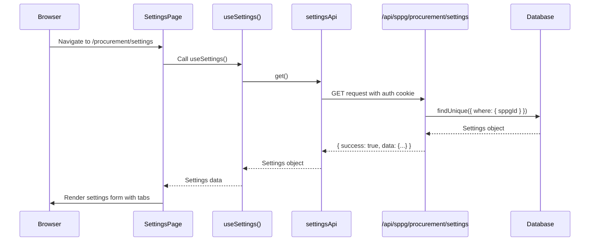

# Procurement Settings Debug - Complete Trace

## Current Status

✅ **Database**: Settings exist for SPPG `DEMO-2025`
✅ **Seed Data**: Complete with 3 approval levels, 4 payment terms, 3 QC checklists
✅ **User**: `admin@demo.sppg.id` linked to correct SPPG
❌ **Frontend**: Shows "Initialize" button instead of settings form

## Root Cause

The error "Failed to initialize settings" occurs because:
1. Settings **already exist** in database (seeded)
2. Page logic incorrectly shows "Initialize" button
3. User clicks button → API returns 409 Conflict
4. Error message displayed

## Debugging Steps Added

### 1. API Endpoint Logging (`route.ts`)
```typescript
console.log('[GET /api/sppg/procurement/settings] Request from:', {
  userId, email, sppgId, userRole
})
console.log('[GET /api/sppg/procurement/settings] Query result:', {
  found: !!settings,
  settingsId,
  approvalLevelsCount,
  paymentTermsCount,
  qcChecklistsCount
})
```

### 2. API Client Logging (`api/index.ts`)
```typescript
console.log('[settingsApi.get] Fetching from:', url)
console.log('[settingsApi.get] Response status:', status)
console.log('[settingsApi.get] Success! Data:', { hasData, dataKeys, ... })
```

### 3. Hook Logging (`hooks/index.ts`)
```typescript
console.log('[useSettings] Fetching settings...')
console.log('[useSettings] API result:', { success, hasData, dataType })
console.log('[useSettings] Returning:', data ? 'settings object' : 'null')
```

### 4. Page Component Logging (`page.tsx`)
```typescript
console.log('[SettingsPage] Settings loaded:', {
  hasGeneralSettings,
  approvalLevelsCount,
  categoriesCount,
  paymentTermsCount,
  qcChecklistsCount
})
```

## Testing Instructions

### Step 1: Open Browser Console
1. Press `F12` to open DevTools
2. Go to **Console** tab
3. Clear console (click trash icon)

### Step 2: Login as Admin
```
URL: http://localhost:3000/login
Email: admin@demo.sppg.id
Password: demo2025
```

### Step 3: Navigate to Settings
```
URL: http://localhost:3000/procurement/settings
```

### Step 4: Check Console Output

**Expected Log Sequence**:
```
[useSettings] Fetching settings...
[settingsApi.get] Fetching from: http://localhost:3000/api/sppg/procurement/settings
[settingsApi.get] Response status: 200 OK
[settingsApi.get] Success! Data: {hasData: true, dataKeys: [...], approvalLevelsCount: 3}
[useSettings] API result: {success: true, hasData: true, dataType: 'object'}
[useSettings] Returning: settings object
[SettingsPage] Settings loaded: {
  hasGeneralSettings: true,
  approvalLevelsCount: 3,
  categoriesCount: 0,
  paymentTermsCount: 4,
  qcChecklistsCount: 3
}
```

**Expected UI**:
- ✅ Settings page with tabs
- ✅ General tab with form fields
- ✅ Approval tab with 3 levels
- ✅ Payment Terms tab with 4 terms
- ✅ QC Checklist tab with 3 checklists
- ❌ NO "Initialize" button

### Step 5: Check Network Tab (if logs incomplete)

1. Go to **Network** tab
2. Filter by "settings"
3. Click on `/api/sppg/procurement/settings` request
4. Check:
   - Status: Should be `200 OK`
   - Response: Should have `{success: true, data: {...}}`
   - Headers: Should have authentication cookie

## Possible Issues & Solutions

### Issue 1: 401 Unauthorized
**Symptoms**:
```
[settingsApi.get] Response status: 401 Unauthorized
```

**Cause**: Not logged in or session expired

**Solution**:
```bash
1. Clear cookies (DevTools → Application → Cookies)
2. Re-login as admin@demo.sppg.id
3. Try again
```

### Issue 2: 403 Forbidden
**Symptoms**:
```
[GET /api/sppg/procurement/settings] Response: 403 Forbidden
Message: "Your account is not associated with any SPPG"
```

**Cause**: User has no `sppgId`

**Solution**:
```bash
# Check user in database
npx tsx scripts/test-settings-api.ts

# If sppgId is null, re-seed:
npm run db:seed
```

### Issue 3: 500 Internal Server Error
**Symptoms**:
```
[settingsApi.get] Response status: 500 Internal Server Error
```

**Cause**: Database error or Prisma client issue

**Solution**:
```bash
# Check server terminal for detailed error
# Regenerate Prisma client
npx prisma generate

# Restart dev server
npm run dev
```

### Issue 4: Settings Return Null
**Symptoms**:
```
[useSettings] API result: {success: true, hasData: false, dataType: 'null'}
[SettingsPage] No settings found, showing initialize button
```

**Cause**: Settings not in database for this SPPG

**Solution**:
```bash
# Verify settings exist
npx tsx scripts/test-settings-api.ts

# If not found, re-seed or initialize via API:
npm run db:seed
```

### Issue 5: CORS or Network Error
**Symptoms**:
```
Failed to fetch
TypeError: NetworkError when attempting to fetch resource
```

**Cause**: Dev server not running or CORS issue

**Solution**:
```bash
# Ensure dev server is running
npm run dev

# Check if http://localhost:3000 is accessible
```

## Quick Verification Script

```bash
# 1. Verify database has settings
npx tsx scripts/test-settings-api.ts

# 2. Check if all seeds consistent
npx tsx scripts/verify-sppg-consistency.ts

# 3. Restart dev server with clean build
npm run dev
```

## Expected Complete Flow



## Files Modified

1. `src/app/api/sppg/procurement/settings/route.ts`
   - Added request logging
   - Added query result logging

2. `src/features/sppg/procurement/settings/api/index.ts`
   - Added fetch logging
   - Added response logging

3. `src/features/sppg/procurement/settings/hooks/index.ts`
   - Added hook execution logging
   - Added data type logging

4. `src/app/(sppg)/procurement/settings/page.tsx`
   - Added settings loaded logging (already done)
   - Enhanced error display (already done)

5. `scripts/test-settings-api.ts` (created)
   - Verify settings exist in database
   - Show complete settings data
   - Validate relationships

## Next Steps

1. **Open browser** with console visible
2. **Login** as admin@demo.sppg.id
3. **Navigate** to settings page
4. **Copy all console logs** and share
5. **Check Network tab** for API response

With comprehensive logging, we can identify exactly where the flow breaks!
